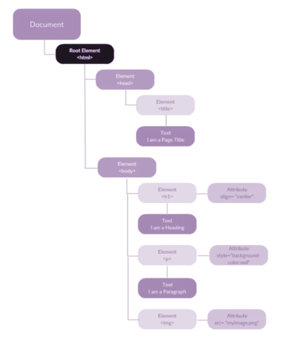

Tal como vimos al inicio del curso, HTML sigue una estructura en árbol con sus nodos

El DOM es la estructura de objetos que genera el navegador con todos sus elementos, lo que nos va a permitir trabajar sobre él y manipularlo.

Los nodos más importantes que debemos conocer:

- **DOCUMENT:** Es el nodo raíz de todo documento HTML
- **ELEMENT**: Es el contenido que se define por las etiquetas/tags de HTML. Estas a su vez pueden tener más hijos element y también atributos
- **ATTR**: Representa los atributos de ese elemento
- **TEXT**: El contenido del texto que se encuentra en una etiqueta HTML



**BÚSQUEDA EN EL DOM**

A través de un API de Javascript podemos acceder y manipular los nodos del DOM. 

Vamos a ver primero como poder recorrer el DOM, para ello, utilizaremos una serie de funciones que nos van a permitir hacerlo:

**querySelector(selector)**

Devuelve el primer elemento del documento que coincida con las especificaciones de selectores.

Por ejemplo, teniendo el siguiente HTML:

```html
<body>
    <h1 id="tituloPrincipal"> Este es un titulo </h1>
		<h1 class="titulos-importantes"> Este es un titulo </h1>
</body>
```

Según el argumento o parámetro que introduzcamos en la función, seleccionará un h1 u otro

```js
/*
	Introduciendo una etiqueta, seleccionará la primera que se encuentre, en este
	caso el primer h1.
*/
element = document.querySelector('h1'); 

/*
	Introduciendo una clase, seleccionará la primera que se encuentre con ese 
	nombre, en este caso el segundo h1.
*/
element = document.querySelector('.titulos-importantes'); 

/*
	Introduciendo un ID, seleccionará la primera que se encuentre con ese 
	nombre, en este caso el primer h1.
*/
element = document.querySelector('#tituloPrincipal'); 

```

**getElementById(id)**

Devuelve el primer elemento con el ID específico. Recordad que los IDs son únicos por lo tanto solo devolverá un elemento.

```js
element = document.getElementById('tituloPrincipal'); 
```

**getElementsByClassName(className)**

Devuelve un array con todos los elementos que tengan esa className.

```js
element = document.getsElementsByClassName('titulos-importantes'); 
```

**querySelectorAll(selector)**

Devuelve un array con todos los elementos que correspondan con el id, clase, etiqueta… introducidos. Es igual que el querySelector pero en vez de devolver el primer elemento que coincida devuelve un array con todos los que coincidan.

```js
element = document.querySelectorAll('h1'); 
```

**MANIPULANDO EL DOM**

De igual manera que podemos acceder a un elemento del DOM, podemos crear, añadir propiedades y modificar esos elementos.

Las funciones básicas que vamos a ver en este bloque son:

**createElement(name)**

Nos permitirá crear un nombre con el elemento que le pasemos por parámetro.

```js
let elementTitulo = document.createElement('h1');
```

**appendChild(node)**

Agrega un nuevo nodo al final de la lista de un elemento hijo de un elemento padre especificado.

```js
elementPadre.appendChild(elementHijo);
```

Vamos a crear por ejemplo, un título que vamos a añadir a un div:

```js
let elementoPadre = document.getElementById('containter');
let elementoHijo = document.createElement('h1');

elementoPadre.appendChild(elementoHijo);
```

```html
<body>
	<div id="containter">
	</div>
</body>
```

**MANEJANDO EL DOM**

Una vez visto como  crear y añadir elementos al DOM, vamos a ver una serie de propiedades que podemos utilizar en nuestros desarrollos

**element.textContent**

Nos permite introducir texto en nuestras etiquetas

```js
elementoHijo.textContent = 'Esto es un H1';
```

Truki: Este atributo también nos permite borrar el contenido e hijos de un bloque. 

**element.classList.add()**

Nos permite introducir clases a una etiqueta. Podemos añadir más de una clase incluyendo más argumentos en la función:

```js
elementoHijo.classList.add('bold-text', 'red-text');
```

**element.setAtributte()**

Que nos permite por ejemplo, incluir la url en una imagen:

```js
element.setAttribute('src', url);
```

**element.style**

Nor permite cambiar el estilo:

```js
element.style.display = 'none';
```
